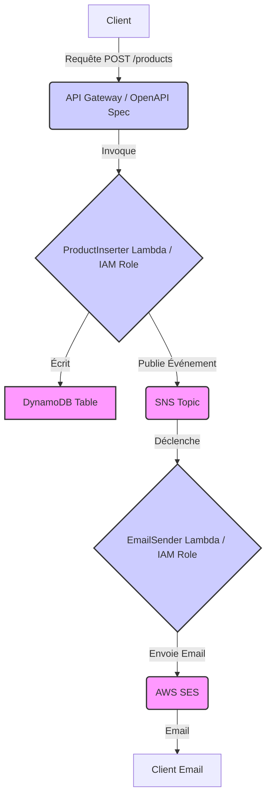
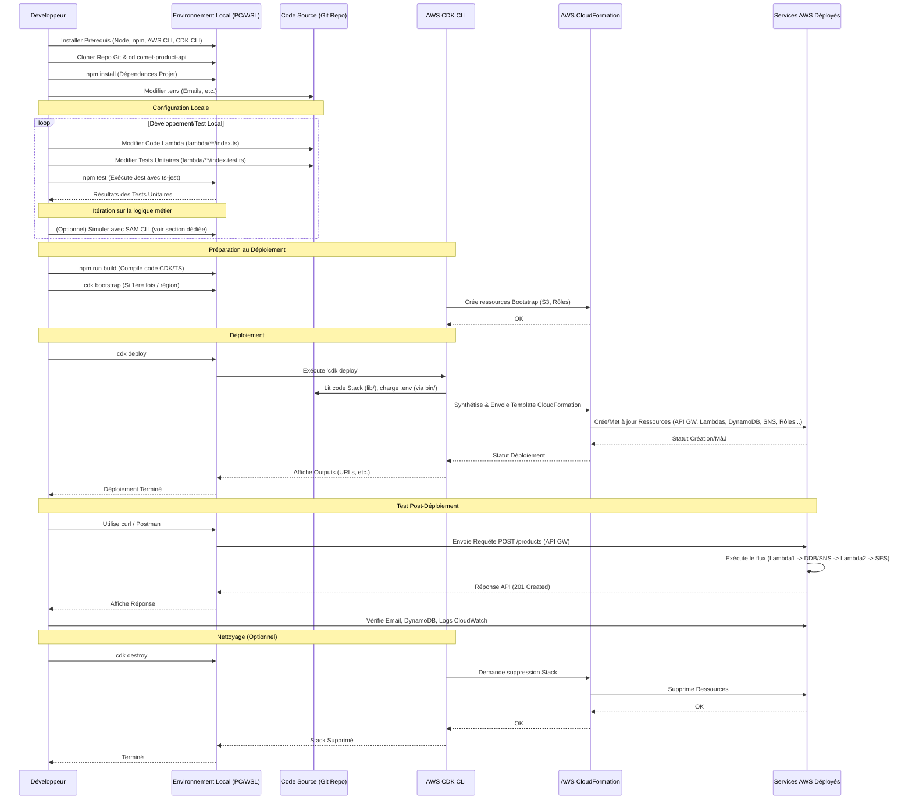

# API d'Insertion de Produits Comet (Event-Driven)

Ce projet implémente une API simple pour insérer de nouveaux produits dans une base de données, avec une notification par email envoyée au client pour chaque ajout. Il utilise une architecture nano-service et événementielle sur AWS.

## Architecture

L'architecture suit un modèle événementiel :

1.  Un client envoie une requête `POST` à l'endpoint `/products` de l'API Gateway.
2.  L'API Gateway valide la requête (grâce au modèle OpenAPI défini) et déclenche la fonction Lambda `ProductInserter`.
3.  La Lambda `ProductInserter` (exécutée avec un rôle IAM spécifique) valide les données métier, les insère dans une table DynamoDB et publie un événement `ProductCreated` dans un Topic SNS.
4.  Le Topic SNS déclenche la fonction Lambda `EmailSender`.
5.  La Lambda `EmailSender` (exécutée avec son propre rôle IAM) lit l'événement, formate un email et utilise AWS SES pour l'envoyer.

**Points Clés de l'Architecture :**
*   **Event-Driven :** Les composants sont découplés via SNS. Le `ProductInserter` ne sait pas qui consomme son événement (ici, `EmailSender`).
*   **Nano-services :** Chaque Lambda a une responsabilité unique et limitée.
*   **Sécurité (IAM) :** Les permissions AWS sont gérées par des **rôles IAM** attachés aux Lambdas et définis dans le CDK. **Aucune clé d'accès AWS n'est stockée dans le code ou la configuration des Lambdas.**



## Technologies Utilisées

*   Langage : TypeScript
*   Infrastructure as Code (IaC) : AWS CDK (Cloud Development Kit)
*   Plateforme Cloud : AWS
    *   API Gateway : Point d'entrée HTTP + Validation + Documentation OpenAPI
    *   Lambda : Fonctions pour la logique métier (insertion, envoi d'email)
    *   DynamoDB : Base de données NoSQL pour les produits
    *   SNS (Simple Notification Service) : Bus d'événements pour découpler les services
    *   SES (Simple Email Service) : Service d'envoi d'emails
    *   IAM (Identity and Access Management) : Gestion des permissions via les rôles
    *   CloudWatch Logs : Centralisation des logs des Lambdas
*   Autres : Node.js, npm, uuid

## Prérequis

Avant de pouvoir déployer et utiliser ce projet, assurez-vous d'avoir les éléments suivants installés et configurés :

1.  **Node.js et npm :**
    *   Installez Node.js (qui inclut npm) si ce n'est pas déjà fait. Une version LTS récente (ex: >= 18.x) est recommandée.
    *   Vérifiez les installations : `node -v` et `npm -v`.
2.  **AWS CLI (Command Line Interface) :**
    *   Installez l'AWS CLI en suivant les [instructions officielles d'AWS](https://docs.aws.amazon.com/cli/latest/userguide/getting-started-install.html).
    *   **Configurez vos identifiants AWS :** Exécutez la commande suivante et suivez les invites pour fournir votre `AWS Access Key ID`, `AWS Secret Access Key`, la `Default region name` (ex: `us-east-1`, `eu-west-1`) et le `Default output format` (ex: `json`).
        ```bash
        aws configure
        ```
        **Important :** Ces identifiants ne sont utilisés que localement par l'AWS CLI et le CDK pour déployer les ressources. Ils ne sont **jamais** inclus dans le code déployé.
3.  **AWS CDK CLI (Cloud Development Kit) :**
    *   Installez la CLI du CDK de manière globale via npm :
        ```bash
        npm install -g aws-cdk
        ```
    *   Vérifiez l'installation : `cdk --version`.
4.  **Compte AWS :** Vous devez avoir un compte AWS actif.
5.  **Identité SES Vérifiée :** Vous devez avoir vérifié une adresse email (ou un domaine) dans AWS SES dans la région AWS où vous allez déployer. C'est cette adresse qui sera utilisée comme expéditeur.

## Installation du Projet

1.  Clonez le dépôt (si ce n'est pas déjà fait).
2.  Naviguez jusqu'au répertoire racine du projet (`comet-product-api`).
3.  Installez les dépendances du projet (bibliothèques CDK, SDK AWS, etc.) :
    ```bash
    npm install
    ```

## Configuration

### 1. Configuration des Emails (Obligatoire)

Avant de déployer, vous **devez** configurer les adresses email utilisées par la Lambda `EmailSender` :

1.  Créez (ou modifiez) le fichier `.env` à la racine du projet.
2.  Définissez les variables suivantes avec vos valeurs :
    ```dotenv
    # .env (Ce fichier est dans .gitignore)
    SENDER_EMAIL_ADDRESS="votre-email-verifie@example.com" 
    RECIPIENT_EMAIL_ADDRESS="destinataire@example.com"
    ```
    *   `SENDER_EMAIL_ADDRESS`: Remplacez par l'adresse email que vous avez vérifiée dans AWS SES.
    *   `RECIPIENT_EMAIL_ADDRESS`: Remplacez par l'adresse email qui doit recevoir les notifications.

**Important - AWS SES Sandbox :**
*   Par défaut, votre compte AWS est dans le "Sandbox" SES.
*   En mode Sandbox, vous ne pouvez envoyer des emails **QU'AUX** adresses et domaines que vous avez **également vérifiés** dans SES.
*   Pour envoyer des emails à n'importe quelle adresse, vous devez demander à AWS de sortir votre compte du mode Sandbox via la console AWS.
*   Pour ce test, assurez-vous que `RECIPIENT_EMAIL_ADDRESS` est aussi une adresse vérifiée ou demandez la sortie du Sandbox.

### 2. Configuration Avancée (Optionnel)

Pour des projets plus complexes ou pour gérer différents environnements (dev, staging, prod), vous pourriez envisager :

*   **Fichiers `.env` pour la configuration :** Utiliser des fichiers comme `.env.dev`, `.env.prod` (ajoutés au `.gitignore`) pour stocker des configurations NON-SENSIBLES (ex: emails, options spécifiques à l'environnement). Vous pourriez ensuite charger le fichier approprié au moment du déploiement en utilisant le contexte CDK (`cdk deploy -c config=dev`).
*   **AWS Systems Manager Parameter Store ou AWS Secrets Manager :** Pour une gestion centralisée et sécurisée des configurations et des secrets (ex: clés API tierces si nécessaire), en particulier pour la production.

**Rappel Sécurité : Ne stockez JAMAIS de clés d'accès AWS (Access Key ID, Secret Access Key) dans des fichiers `.env` ou dans le code source.** Utilisez les rôles IAM pour les permissions des ressources AWS déployées.

## Déploiement

Une fois les Prérequis et la Configuration terminés (notamment `aws configure` et la mise à jour du fichier `.env`), suivez ces étapes pour déployer l'infrastructure et les Lambdas sur votre compte AWS :

1.  **Compiler le code CDK et les Lambdas (si nécessaire) :**
    ```bash
    npm run build 
    ```
    *(Ce script exécute généralement `tsc` basé sur votre `tsconfig.json`)*
2.  **(Une seule fois par compte/région) Initialiser l'environnement CDK (Bootstrap) :**
    ```bash
    cdk bootstrap
    ```
    *(Sautez si déjà fait pour ce compte/région)*
3.  **Déployer le Stack :**
    ```bash
    cdk deploy
    ```
    Cette commande crée/met à jour les ressources AWS. Elle affichera les `Outputs` (URLs, etc.) à la fin.
    *(Répondez `y` à la confirmation des changements IAM si demandé)*

## Utilisation

### 1. Tester l'API via cURL

Une fois le déploiement terminé, récupérez la valeur de `ApiUrlOutput`.

Envoyez une requête `POST` à l'endpoint `/products` :

```bash
# Remplacez <ApiUrlOutput> par l'URL obtenue après `cdk deploy`
curl -X POST <ApiUrlOutput>/products \
-H "Content-Type: application/json" \
-d '{
  "name": "Mon Super Produit Test",
  "description": "Test depuis cURL",
  "price": 123.45
}'
```

Vous devriez recevoir une réponse `201 Created` avec les détails du produit créé. Si la configuration SES est correcte (adresse expéditeur vérifiée, destinataire vérifié ou hors sandbox), un email devrait être envoyé à `RECIPIENT_EMAIL_ADDRESS`.

### 2. Tester l'API via Postman (avec OpenAPI)

1.  Récupérez l'URL fournie par la sortie `OpenApiSpecExportUrl` après le déploiement.
2.  Ouvrez cette URL dans votre navigateur. Cela devrait télécharger un fichier `swagger.json` (ou l'afficher). Sauvegardez ce fichier.
    *(Note: Il peut y avoir un petit délai après le déploiement avant que cette URL ne soit active).* 
3.  Ouvrez Postman.
4.  Allez dans `File -> Import...` (ou l'équivalent).
5.  Uploadez le fichier `swagger.json` que vous avez téléchargé.
6.  Postman va importer la définition de l'API, créant une collection avec la requête `POST /products` pré-configurée (URL, méthode, et un exemple de corps JSON basé sur le modèle).
7.  Vous pouvez alors exécuter la requête directement depuis Postman.

### 3. Consulter les Logs

Les logs des fonctions Lambda (`ProductInserterLambda`, `EmailSenderLambda`) sont visibles dans **AWS CloudWatch Logs**. Recherchez les groupes de logs nommés d'après les fonctions Lambda dans la console AWS.

## Testing

Ce projet inclut des tests unitaires pour les fonctions Lambda.

### Lancer les Tests

```bash
npm test
```

### Configuration des Tests

Les variables d'environnement nécessaires aux tests (ex: noms de table/topic fictifs, emails de test) sont définies directement dans les fichiers `*.test.ts` (dans `lambda/product-inserter/` et `lambda/email-sender/`) via les blocs `beforeEach` ou `beforeAll`.

**Pour modifier les valeurs utilisées par les tests :**

*   Ouvrez le fichier `.test.ts` concerné.
*   Localisez les blocs `beforeEach`/`beforeAll`.
*   Modifiez les valeurs assignées à `process.env`.

**Important :** Ces valeurs de test sont indépendantes de celles du fichier `.env` principal et du déploiement réel.

## Commandes CDK Utiles

*   `npm run build`: Compiler le code TypeScript du CDK (et potentiellement les Lambdas selon la configuration).
*   `cdk list` ou `cdk ls`: Lister les stacks dans l'application CDK.
*   `cdk deploy`: Déployer ce stack sur votre compte/région AWS par défaut.
*   `cdk diff`: Comparer le stack déployé avec l'état actuel défini dans le code.
*   `cdk synth`: Émettre le template CloudFormation synthétisé (sans déployer).
*   `cdk destroy`: **Supprimer** le stack CloudFormation et **toutes** les ressources AWS associées (API, Lambdas, Table DynamoDB, Topic SNS...). Utile pour nettoyer après le test.

## Flux de Développement et Déploiement

Le diagramme de séquence suivant illustre les étapes typiques suivies par un développeur pour configurer, développer, tester et déployer cette application :


